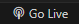
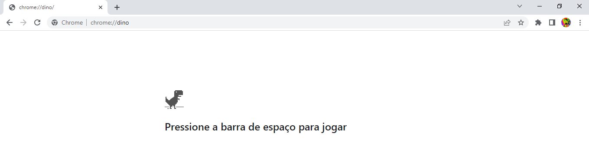
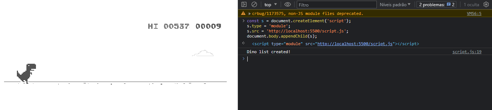

# DinoAI
#### This project implements an Artificial Intelligence (AI) system that plays the Dino game. The AI utilizes machine learning algorithms to learn and improve its gameplay over time.

## Installation
#### Clone the repository: 

```
git clone https://github.com/AkinoriKoerich/DinoAI.git
```

## Usage
- Use the extension "Live Server"

- Go Live! <br>


- Open your browser and search for dino game: <br>


- Show console with F12 or CTRL + Shift + C <br>

- Paste this code in console and press enter: <br>
```
const s = document.createElement('script');
s.type = 'module';
s.src = 'http://localhost:5500/script.js';
document.body.appendChild(s);
```



### Observe how the AI adapts and learns from its gameplay every 10 dinos.
### The AI's performance will improve over time.